  

<table cellspacing="0" cellpadding="0" border="0" width="100%">
  <tr>
    <td valign="middle" width="58%">
      <h3>𝐌𝐞 🤝 𝐀𝐈</h3>
      
Still trying to figure out who's training who.

      
I build AI systems, break them, fix them, and then somehow call it engineering.

      
Currently obsessed with <strong>LLMs, AI Agents, RAG, LangGraph, MCP &amp; automation.</strong>

      
If it involves an AI agent doing something it probably shouldn't be doing...

      
<strong>I'll probably build it.</strong> 😭

      btw I’m Samia... maybe your next AI Engineer?
    </td>
    <td valign="middle" width="42%" align="right">
      
    </td>
  </tr>
</table>

 

  

<h3 id="projects" align="center">𝐏𝐫𝐨𝐣𝐞𝐜𝐭𝐬</h3>

 
<h3 id="legal-ai" align="left">𝐏𝐨𝐰𝐞𝐫𝐢𝐧𝐠 𝐋𝐞𝐠𝐚𝐥 𝐑𝐞𝐬𝐞𝐚𝐫𝐜𝐡 — 𝐋𝐞𝐠𝐚𝐥 𝐀𝐈 𝐀𝐬𝐬𝐢𝐬𝐭𝐚𝐧𝐭</h3>

<table cellspacing="0" cellpadding="0" border="0" width="100%">
  <tr>
    <td valign="top" width="34%">
      
    </td>
    <td valign="top" width="66%">
      
<strong>What if lawyers could prepare research memos faster</strong> by finding the right case, statute, precedent, or evidence without manually going through hundreds of legal documents?

      
That was the problem I wanted to solve. So I built a <strong>RAG-based Legal AI Assistant</strong> designed around Pakistan's criminal and cyber law ecosystem. Instead of treating an LLM as a simple chatbot, I wanted it to <strong>search, reason over, and connect legal information</strong> from statutes, case law, and case-specific documents.

    </td>
  </tr>
</table>

The system brings together important legal sources such as the <strong>Pakistan Penal Code (PPC), Prevention of Electronic Crimes Act (PECA), Code of Criminal Procedure (CrPC), and Qanun-e-Shahadat Order</strong>, along with provincial laws and court judgments. But legal research isn't only about finding a law. A lawyer may need to know <strong>which precedent supports an argument, whether a section applies, what procedure should have been followed, or whether evidence is consistent with earlier statements.</strong> That's where I introduced a <strong>Multi-Agent architecture</strong>, giving different agents specialized responsibilities instead of making one agent handle everything. The <strong>Statute Agent</strong> focuses on legal provisions, while the <strong>Case Law Agent</strong> searches judgments and precedents. Other agents work with uploaded <strong>FIRs, challans, Section 161 statements, court depositions, and forensic reports</strong> to extract information, build timelines, identify inconsistencies, and connect evidence across documents.

Legal documents can also be messy, especially scanned documents, handwritten material, or PDFs that aren't directly searchable. So I integrated <strong>OCR + RAG</strong> to turn unstructured documents into usable, searchable information. And probably the most important part: <strong>trust.</strong> I didn't want the system to simply generate a confident-sounding legal answer, so responses are designed to be <strong>citation-backed</strong>, allowing lawyers to trace claims back to the underlying legal source or document and verify them. I also added <strong>Voice Agents</strong>, allowing lawyers to ask questions, follow up, dig deeper into a case, and continue their research conversationally. The goal wasn't to build <strong>"another legal chatbot."</strong> It was to build something closer to a <strong>research assistant for legal professionals</strong>, one that can retrieve the right information, connect different sources, provide supporting citations, and make large collections of legal documents easier to work with.

 
 

<h3 id="contributions" align="center">𝐂𝐨𝐧𝐭𝐫𝐢𝐛𝐮𝐭𝐢𝐨𝐧 𝐆𝐫𝐚𝐩𝐡</h3>

<!-- SNAKE_GRID:START -->

  <picture>
    <source media="(prefers-color-scheme: dark)" srcset="https://raw.githubusercontent.com/Samianadeem2005/Samianadeem2005/output/github-contribution-grid-snake-dark.svg">
    <source media="(prefers-color-scheme: light)" srcset="https://raw.githubusercontent.com/Samianadeem2005/Samianadeem2005/output/github-contribution-grid-snake.svg">
    
  </picture>

<!-- SNAKE_GRID:END -->

<h3 id="connect" align="center">𝐋𝐞𝐭𝐬 𝐂𝐨𝐧𝐧𝐞𝐜𝐭</h3>

  

    
    
  

